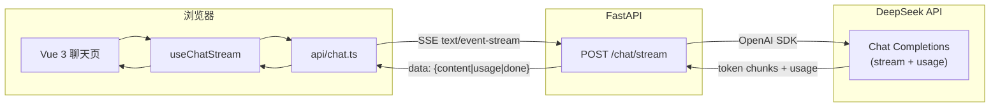

# LLM

基于 **Vue 3 + FastAPI + DeepSeek** 的全栈流式 AI 聊天应用，适合作为前端 / 全栈学习项目与作品集展示。

## 功能亮点

- SSE 流式输出，边生成边显示
- 多会话、多轮对话、角色设定（System Prompt）
- Markdown 渲染与代码高亮
- 模型选择与温度调节（0～2）
- Token 用量展示（输入 / 输出 / 合计）
- 导出对话为 Markdown / JSON
- 深色 / 浅色主题，消息与面板动效
- 后端 pytest 单元测试

## 在线 Demo

> 部署后把链接填在这里，例如：`https://llm.vercel.app`

本地体验：

- 前端：<http://localhost:5173/chat>
- 后端：<http://localhost:8000/docs>

## 架构概览



### 一次对话的数据流

1. 用户在输入框发送消息，前端把 `message`、`history`、`system`、`model`、`temperature` 组装为 JSON。
2. `fetch('/api/chat/stream')` 经 Vite 代理到 FastAPI。
3. 后端校验 Pydantic 模型 → `build_messages` 拼接上下文 → 调用 DeepSeek 流式接口。
4. 服务端把每个 token 包装为 `data: {"content":"..."}\n\n` 推送；结束时推送 `usage` 与 `done`。
5. 前端 `for await` 消费 SSE，实时更新气泡，并展示 Token 统计。

## 快速开始

### 一键启动（推荐）

完成下方「首次初始化」后，在**项目根目录**执行：

```bash
# 方式一：直接运行脚本
bash scripts/dev.sh

# 方式二：npm / pnpm 均可
npm run dev
# 或
pnpm dev
```

- 后端：<http://localhost:8000/docs>
- 前端：<http://localhost:5173/chat>
- `Ctrl+C` 会同时停止前后端

### 首次初始化

**后端**

```bash
cd server
python3 -m venv venv
source venv/bin/activate
pip install -r requirements.txt
cp .env.example .env   # 填入 DEEPSEEK_API_KEY
```

**前端**

```bash
cd web
pnpm install
```

### 分别启动（可选）

```bash
# 终端 1 — 后端
cd server && source venv/bin/activate && uvicorn main:app --reload --port 8000

# 终端 2 — 前端
cd web && pnpm dev
```

浏览器打开 <http://localhost:5173/chat>。

### 测试

```bash
# 后端
cd server && source venv/bin/activate && pytest

# 前端类型检查 + 单元测试
cd web && pnpm typecheck && pnpm test:run
```

## 项目结构

```text
studyLLM/
├── README.md                 # 本文件
├── docs/
│   └── screenshots/          # 作品集截图（见下方说明）
├── server/                   # FastAPI + DeepSeek
│   ├── app/
│   │   ├── api/routes/chat.py
│   │   ├── schemas/chat.py
│   │   └── services/llm.py
│   └── tests/
└── web/                      # Vue 3 + Vite
    ├── src/                  # 业务源码
    ├── tests/                # Vitest 单元测试（目录对应 src/）
    └── package.json
```

## 截图 / GIF

将界面截图放入 `docs/screenshots/`，README 中即可直接引用：

| 文件 | 建议内容 |
|------|----------|
| `01-welcome.png` | 欢迎页 + 示例问题 |
| `02-streaming.png` | 流式回复 + Markdown 代码块 |
| `03-model-settings.png` | 模型与温度设置面板 |
| `04-dark-mode.png` | 深色主题 |
| `05-export.png` | 导出菜单 / Token 展示 |

示例（截图放入后取消注释）：

```markdown


```

录制 GIF 可用 macOS `Cmd+Shift+5` 或 [Kap](https://getkap.co/)，保存为 `docs/screenshots/demo.gif`。

## 环境变量摘要

| 变量 | 说明 | 默认 |
|------|------|------|
| `DEEPSEEK_API_KEY` | DeepSeek API 密钥 | — |
| `DEEPSEEK_MODEL` | 默认模型 | `deepseek-v4-flash` |
| `CHAT_DEFAULT_TEMPERATURE` | 默认温度 | `0.7` |
| `CHAT_ALLOWED_MODELS` | 允许的前端模型列表 | 见 `server/.env.example` |
| `VITE_BASE_API` | 前端代理目标 | `http://localhost:8000` |

详细说明见 [`server/README.md`](server/README.md) 与 [`web/README.md`](web/README.md)。

## 技术栈

| 层级 | 技术 |
|------|------|
| 前端 | Vue 3、TypeScript、Vite、Pinia、Ant Design Vue、markdown-it |
| 后端 | FastAPI、Pydantic、OpenAI SDK（DeepSeek 兼容）、slowapi |
| AI | DeepSeek Chat Completions（SSE + usage） |

## License

MIT（可按需修改）
