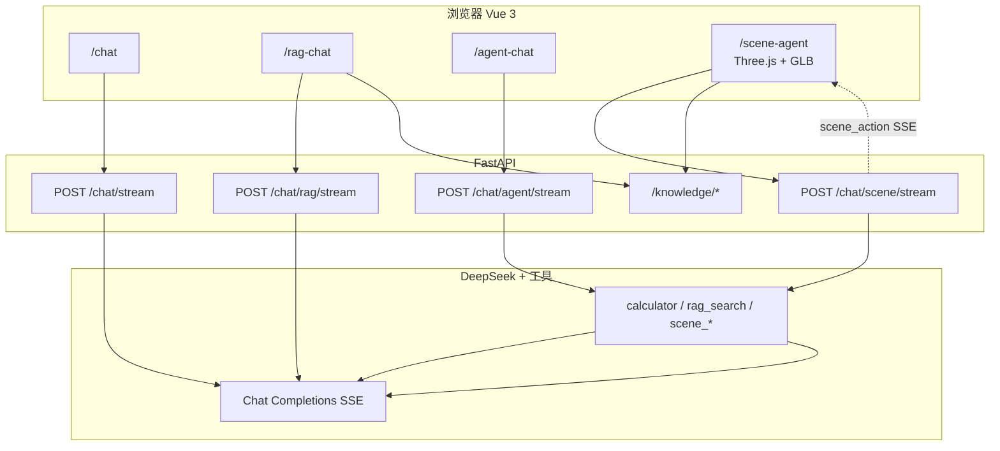

# LLM

基于 **Vue 3 + FastAPI + DeepSeek** 的全栈 AI 应用，从流式对话逐步扩展到 **RAG 知识库**、**工具 Agent** 与 **3D 场景 Agent**，适合作为前端 / 全栈学习项目与作品集展示。

## 功能亮点

### Phase 1 — 流式对话

- SSE 流式输出，边生成边显示
- 多会话、多轮对话、角色设定（System Prompt）
- Markdown 渲染与代码高亮
- 模型选择与温度调节（0～2）
- Token 用量展示（输入 / 输出 / 合计）
- 导出对话为 Markdown / JSON
- 深色 / 浅色主题，消息与面板动效

### Phase 2 — 知识库 RAG

- 知识库 CRUD、多格式文档上传（txt / md / pdf / Office / 图片 OCR）
- BGE-M3 向量检索 + Chroma
- 知识库问答页，流式回答并展示引用来源

### Phase 3 — 工具 Agent

- Function Calling 与 LangChain Agent 两套实现
- 内置 `calculator`、`text_formatter` 等工具
- Agent 可绑定知识库，先 `rag_search` 再回答
- 前端展示工具调用步骤（tool steps）

### Phase 4 — 3D 场景 Agent

- Three.js 加载 GLB 模型（Meshopt + KTX2 + Draco）
- 点击选中模型、顶栏手动「解释选中模型」
- 自然语言 / 语音控制场景：移动、旋转、聚焦、高亮
- Agent 返回 `scene_action`，前端在浏览器执行 Three.js 变换
- 可选绑定知识库 RAG

## 页面路由

| 路由 | 说明 |
|------|------|
| `/chat` | 自由对话（Phase 1） |
| `/knowledge` | 知识库管理（Phase 2） |
| `/rag-chat` | 知识库问答（Phase 2） |
| `/agent-chat` | 工具 Agent（Phase 3） |
| `/scene-agent` | 3D 场景 Agent（Phase 4） |

## 在线 Demo

> 部署后把链接填在这里，例如：`https://llm.vercel.app`

本地体验：

- 前端：<http://localhost:5173/chat>
- 后端 API 文档：<http://localhost:8000/docs>

## 架构概览



### Scene Agent 数据流（Phase 4）

1. 用户上传 GLB，前端 Three.js 渲染并维护 `scene_objects` 快照。
2. 发送消息时，前端把对象列表、选中 id、知识库 id 一并 POST 到 `/chat/scene/stream`。
3. 后端 Scene Agent 调用 `scene_list` / `scene_move` 等工具，生成 JSON 指令。
4. SSE 推送 `scene_action` 事件，前端 `executeSceneAction` 更新 3D 场景；同时流式输出自然语言说明。

## 快速开始

> **Clone 后完整使用教程（安装 + Phase 1～4 操作步骤）见 [docs/GETTING_STARTED.md](docs/GETTING_STARTED.md)。**

```bash
git clone https://github.com/zzdream/OmniChat.git
cd OmniChat
```

### 一键启动（推荐）

完成下方「首次初始化」后，在**项目根目录**执行：

```bash
# 方式一：直接运行脚本
bash scripts/dev.sh

# 方式二：npm / pnpm 均可
npm run dev
# 或
pnpm dev
```

- 后端：<http://localhost:8000/docs>
- 前端：<http://localhost:5173/chat>
- `Ctrl+C` 会同时停止前后端

### 首次初始化

**后端**

```bash
cd server
python3 -m venv venv
source venv/bin/activate
pip install -r requirements.txt
cp .env.example .env   # 填入 DEEPSEEK_API_KEY
```

> Phase 2 RAG 首次运行会下载 BGE-M3 嵌入模型，体积较大，可配置 `HF_ENDPOINT` 镜像加速。

**前端**

```bash
cd web
pnpm install
```

### 分别启动（可选）

```bash
# 终端 1 — 后端
cd server && source venv/bin/activate && uvicorn main:app --reload --port 8000

# 终端 2 — 前端
cd web && pnpm dev
```

浏览器打开 <http://localhost:5173/chat>。

### 测试

```bash
# 后端（含 RAG / Agent / Scene 测试，LLM 已 mock）
cd server && source venv/bin/activate && pytest

# 前端类型检查 + 单元测试
cd web && pnpm typecheck && pnpm test:run
```

## 项目结构

```text
studyLLM/
├── README.md
├── docs/
│   ├── GETTING_STARTED.md    # Clone 后上手指南
│   └── screenshots/          # 作品集截图
├── server/                   # FastAPI + DeepSeek
│   ├── main.py               # 入口，挂载 Phase 1–4 路由
│   ├── app/
│   │   ├── api/routes/       # chat / knowledge / chat_rag / chat_agent / chat_scene
│   │   ├── services/
│   │   │   ├── llm.py
│   │   │   ├── rag/          # 解析、分块、向量检索
│   │   │   ├── agent/        # LangChain Agent、Scene Agent
│   │   │   └── tools/        # calculator、rag_search、scene_actions
│   │   └── bootstrap_*.py    # 按 Phase 挂载路由
│   └── tests/
└── web/                      # Vue 3 + Vite + Three.js
    ├── src/
    │   ├── views/            # chat / knowledge / rag-chat / agent-chat / scene-agent
    │   ├── hooks/            # use-chat-stream / use-rag-chat / use-scene-three …
    │   └── api/
    ├── public/basis/         # KTX2 纹理解码
    ├── public/draco/         # Draco 网格解码
    └── tests/
```

## 截图 / GIF

将界面截图放入 `docs/screenshots/`，README 中即可直接引用：

| 文件 | 建议内容 |
|------|----------|
| `01-welcome.png` | 欢迎页 + 示例问题 |
| `02-streaming.png` | 流式回复 + Markdown 代码块 |
| `03-model-settings.png` | 模型与温度设置面板 |
| `04-dark-mode.png` | 深色主题 |
| `05-export.png` | 导出菜单 / Token 展示 |
| `06-scene-agent.png` | （可选）3D 场景 + Agent 对话 |

示例（截图放入后取消注释）：

```markdown


```

录制 GIF 可用 macOS `Cmd+Shift+5` 或 [Kap](https://getkap.co/)，保存为 `docs/screenshots/demo.gif`。

## 环境变量摘要

| 变量 | 说明 | 默认 |
|------|------|------|
| `DEEPSEEK_API_KEY` | DeepSeek API 密钥 | — |
| `DEEPSEEK_MODEL` | 默认模型 | `deepseek-v4-flash` |
| `CHAT_DEFAULT_TEMPERATURE` | 默认温度 | `0.7` |
| `CHAT_ALLOWED_MODELS` | 允许的前端模型列表 | 见 `server/.env.example` |
| `BGE_M3_MODEL` | RAG 嵌入模型 | `BAAI/bge-m3` |
| `RAG_CHUNK_SIZE` | 文档分块大小 | `500` |
| `AGENT_MAX_ITERATIONS` | Agent 最大工具轮次 | `5` |
| `SCENE_DEFAULT_SYSTEM` | Scene Agent 系统提示词 | 见 `config_scene.py` |
| `VITE_BASE_API` | 前端代理目标 | `http://localhost:8000` |

完整配置见 [`server/.env.example`](server/.env.example)、[`server/README.md`](server/README.md) 与 [`web/README.md`](web/README.md)。

## 技术栈

| 层级 | 技术 |
|------|------|
| 前端 | Vue 3、TypeScript、Vite、Pinia、Ant Design Vue、Three.js、markdown-it |
| 后端 | FastAPI、Pydantic、LangChain、OpenAI SDK（DeepSeek 兼容）、Chroma、slowapi |
| AI | DeepSeek Chat Completions（SSE + Function Calling + usage） |
| RAG | BGE-M3 嵌入、Chroma 向量库、多格式解析 + OCR |
| 3D | Three.js GLTFLoader、Meshopt / KTX2 / Draco、Web Speech API |

## License

MIT（可按需修改）
